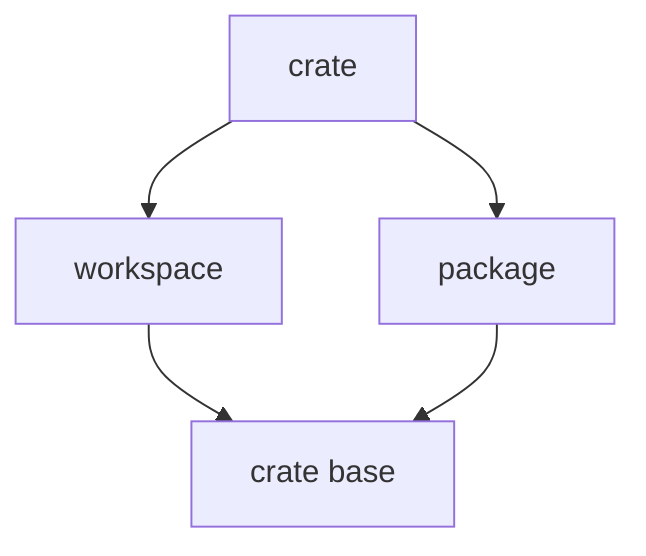
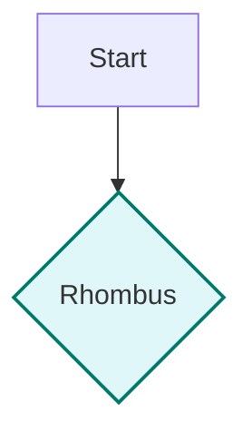

- crate is generic term of package and workspace.
	- crate can be package, workspace or both.

```mermaid
flowchart TD
    A[crate] --> B[workspace]
    A --> C[package]
    B --> D[crate base]
    C --> D
```

```mermaid
flowchart TD
    classDef rhombus shape:diamond,fill:#e0f7fa,stroke:#00796b,stroke-width:2px;
    A[Start] --> B{Rhombus}
    class B rhombus;
```
