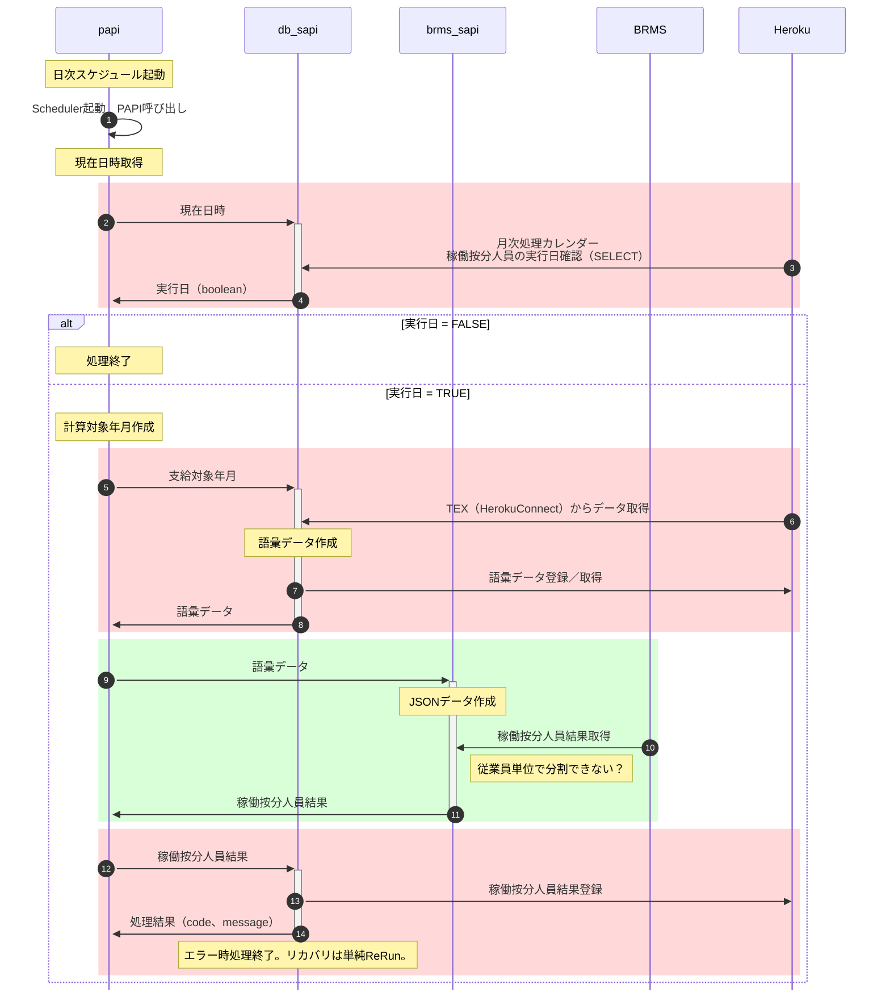

# 稼働按分
概要
ある月（処理年月）において、従業員がどの案件にどのくらいの割合で稼働したかを算出する。

・起動：Scheduler (仮)  
　　月次処理カレンダーを利用予定  
　　勤怠確定後起動。（給与計算以降、？？？以前）  
・システムエラー時、処理終了  
・リカバリ方針、単純ReRun  
　※ロールバック不要。ReRun時、計算対象年月で洗替え。

## シーケンス

```mermaid
---
config:
  sequence:
    mirrorActors: false
---
sequenceDiagram
autonumber

%% participant sc as Scheduler
participant papi as papi
participant dsapi as db_sapi
participant bsapi as brms_sapi
participant brms as BRMS
participant db as Heroku

note over papi: 日次スケジュール起動

papi ->> papi: Scheduler起動　PAPI呼び出し
activate papi

note over papi: 現在日時取得

rect rgb(255, 128, 128, 0.3)
papi ->>+ dsapi : 現在日時
db ->> dsapi : 月次処理カレンダー<br/>稼働按分人員の実行日確認（SELECT）
dsapi ->>- papi : 実行日（boolean）
end

alt 実行日 = FALSE
note over papi: 処理終了
else 実行日 = TRUE

note over papi: 計算対象年月作成

rect rgb(255, 128, 128, 0.3)
papi ->>+ dsapi : 支給対象年月
db ->> dsapi : TEX（HerokuConnect）からデータ取得
note over dsapi: 語彙データ作成
dsapi ->> db : 語彙データ登録／取得
dsapi ->>- papi : 語彙データ
end

rect rgb(128, 255, 128, 0.3)
papi ->>+ bsapi : 語彙データ

note over bsapi: JSONデータ作成
brms ->> bsapi : 稼働按分人員結果取得
note right of bsapi: 従業員単位で分割できない？
bsapi ->>- papi : 稼働按分人員結果
end

rect rgb(255, 128, 128, 0.3)
papi ->>+ dsapi : 稼働按分人員結果
dsapi ->> db : 稼働按分人員結果登録
dsapi ->>- papi : 処理結果（code、message）
note over dsapi: エラー時処理終了。リカバリは単純ReRun。
end

end

```